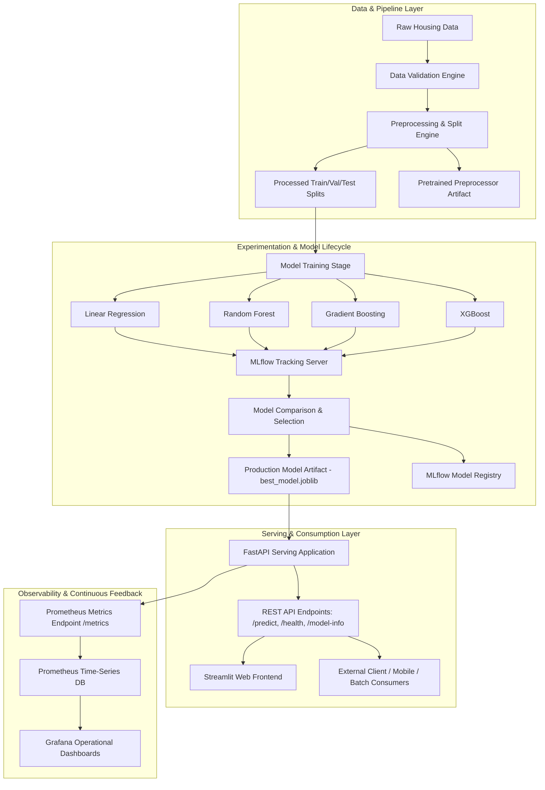
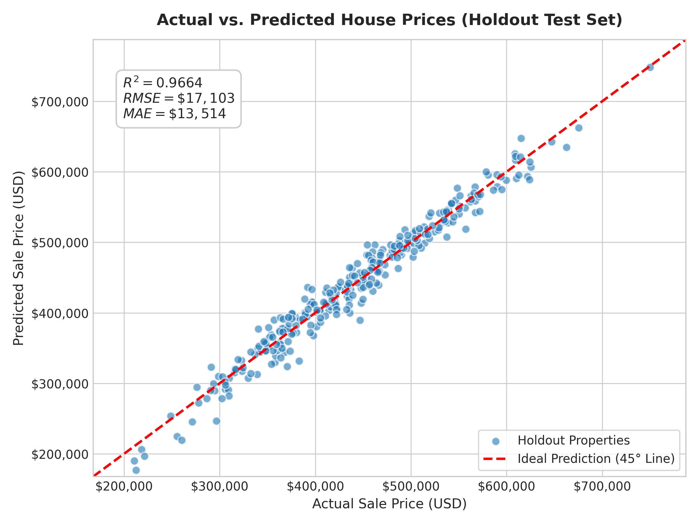
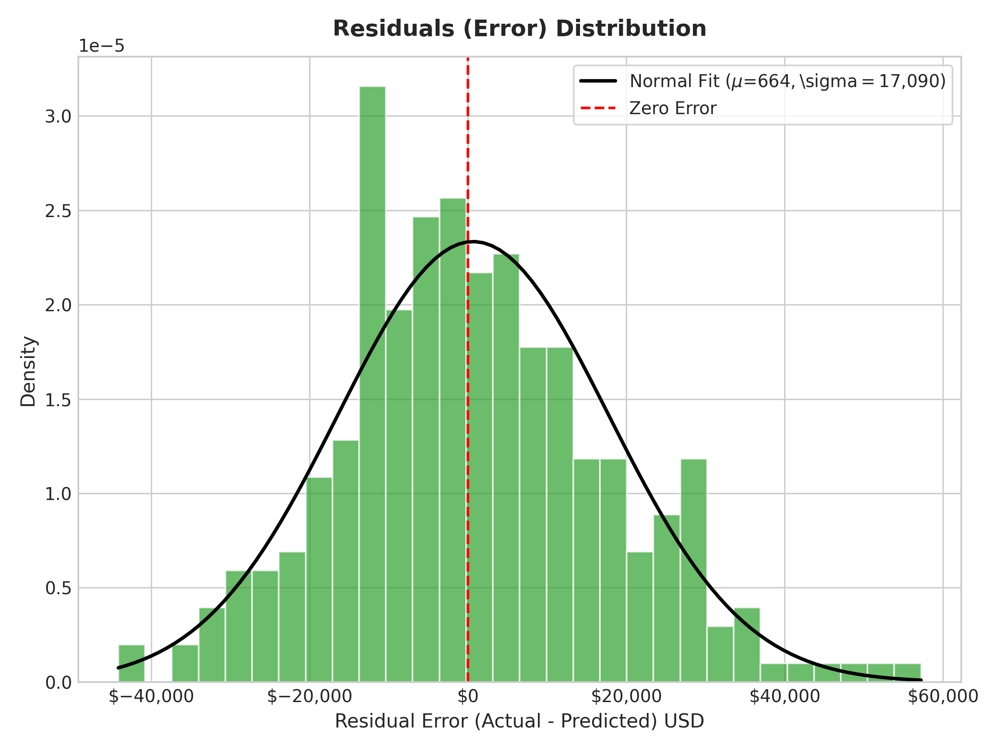
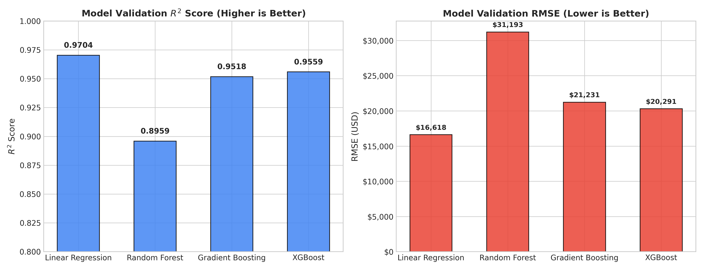

# End-to-End MLOps Pipeline for House Price Prediction

[](https://house-price-prediction-system360.streamlit.app/)
[](https://www.python.org/downloads/)
[](https://fastapi.tiangolo.com)
[](https://house-price-prediction-system360.streamlit.app/)
[](https://mlflow.org)
[](https://dvc.org)
[](https://www.docker.com)
[](https://opensource.org/licenses/MIT)

> 🚀 **Live Interactive Web Application:** **[https://house-price-prediction-system360.streamlit.app/](https://house-price-prediction-system360.streamlit.app/)**  
> 🔗 **Live FastAPI Swagger Docs (Render):** **[https://house-price-prediction-system-9clo.onrender.com/docs](https://house-price-prediction-system-9clo.onrender.com/docs)**

> A complete, production-grade Machine Learning Operations (MLOps) system demonstrating the entire lifecycle of an enterprise tabular regression model: from automated data validation and experiment tracking to model versioning, REST API serving, containerization, CI/CD, and operational telemetry monitoring.

---

## Table of Contents
1. [Project Overview](#1-project-overview)
2. [Problem Statement](#2-problem-statement)
3. [Objectives](#3-objectives)
4. [Key Features](#4-key-features)
5. [System Architecture](#5-system-architecture)
6. [Technology Stack](#6-technology-stack)
7. [Dataset Description](#7-dataset-description)
8. [Project Structure](#8-project-structure)
9. [Installation & Setup](#9-installation--setup)
10. [Environment Configuration](#10-environment-configuration)
11. [Data Pipeline & Validation](#11-data-pipeline--validation)
12. [Model Training & Experiment Tracking](#12-model-training--experiment-tracking)
13. [MLflow Tracking & Model Registry](#13-mlflow-tracking--model-registry)
14. [DVC Pipeline Management](#14-dvc-pipeline-management)
15. [FastAPI Model Serving](#15-fastapi-model-serving)
16. [Streamlit Web Interface](#16-streamlit-web-interface)
17. [Docker & Container Orchestration](#17-docker--container-orchestration)
18. [Automated Testing Suite](#18-automated-testing-suite)
19. [Monitoring & Observability](#19-monitoring--observability)
20. [CI/CD Automation](#20-cicd-automation)
21. [Model Retraining Workflow](#21-model-retraining-workflow)
22. [Example API Request & Response](#22-example-api-request--response)
23. [Screenshots & Visual Demos](#23-screenshots--visual-demos)
24. [Limitations](#24-limitations)
25. [Future Improvements](#25-future-improvements)
26. [Academic Project Notes & Viva Guide](#26-academic-project-notes--viva-guide)

---

## 1. Project Overview

The **End-to-End MLOps Pipeline for House Price Prediction** is an academic and engineering capstone project designed to showcase how machine learning models transition from research prototypes to production software systems. 

Rather than stopping at a standalone notebook, this repository implements the full industrial MLOps lifecycle:
```
DATA ──> VALIDATION ──> PREPROCESSING ──> TRAINING ──> EXPERIMENT TRACKING
                                                              │
                                                              ▼
MONITORING <── CI/CD <── CONTAINERIZATION <── UI <── API <── MODEL REGISTRY
```

---

## 2. Problem Statement

Residential real estate valuation is a critical task for home buyers, sellers, mortgage lenders, and tax assessors. Property appraisal involves evaluating multi-dimensional physical characteristics, spatial coordinates, construction quality, and neighborhood dynamics. 

This project formulates property valuation as a **supervised regression task**, predicting the fair market sale price (`SalePrice` in USD) from structured physical and categorical property features while enforcing data integrity, zero data leakage, and sub-millisecond serving latency.

---

## 3. Objectives

- **Automated Data Validation:** Enforce strict schema constraints and detect corrupt or out-of-bounds records before model training.
- **Reproducible Data Preprocessing:** Encapsulate numerical imputation, scaling, and categorical one-hot encoding in reusable scikit-learn transformers.
- **Multi-Model Experiment Tracking:** Train, benchmark, and compare four regression architectures (Linear Regression, Random Forest, Gradient Boosting, XGBoost) and log all artifacts to MLflow.
- **Model Registry & Governance:** Programmatically identify and register the best-performing model based on validation metrics ($R^2$ and RMSE).
- **Production REST API Serving:** Deliver predictions through a high-performance FastAPI service with Pydantic type validation and automatic Swagger documentation.
- **Interactive Web Interface:** Provide a responsive Streamlit UI for non-technical users and viva demonstration.
- **Containerization:** Containerize all microservices with Docker and Docker Compose.
- **Continuous Integration (CI/CD):** Enforce linting, testing, and Docker build verification using GitHub Actions.
- **Operational Monitoring:** Instrument Prometheus metrics to track request rates, latency distributions, and prediction values in real time.

---

## 4. Key Features

- **Strict Schema Enforcement:** Automatic type validation, value bounds, and null threshold checks using modular validation rules.
- **Zero Data Leakage:** Preprocessing transformations fitted exclusively on training splits.
- **Unified Pipeline Artifact:** Single composite `.joblib` model artifact containing both preprocessors and estimator.
- **4 Benchmark Architectures:** Linear Regression ($R^2=0.9704$), Random Forest ($R^2=0.8959$), Gradient Boosting ($R^2=0.9518$), and XGBoost ($R^2=0.9559$).
- **Local & Remote MLflow Tracking:** Stores metrics and serialized models in a local SQLite database (`sqlite:///mlflow.db`).
- **Interactive Swagger Documentation:** Built-in interactive testing sandbox at `http://localhost:8000/docs`.
- **Prometheus Telemetry:** Native scrape endpoint at `/metrics` measuring P50/P95/P99 latency and prediction histograms.
- **100% Passing Test Suite:** Comprehensive Pytest coverage verifying data ingestion, preprocessing, inference bounds, and API responses.

---

## 5. System Architecture



---

## 6. Technology Stack

| Category | Technology | Usage |
| :--- | :--- | :--- |
| **Language** | Python 3.11+ | Core programming runtime |
| **Data Manipulation** | Pandas, NumPy | Data wrangling and array operations |
| **Machine Learning** | Scikit-learn, XGBoost | Preprocessing pipelines and regression models |
| **Experiment Tracking** | MLflow | Metric logging, parameter tracking, model registry |
| **Data Versioning** | DVC | Pipeline orchestration (`dvc.yaml`) and data lineage |
| **Model Serving** | FastAPI, Uvicorn | Production asynchronous REST API |
| **Frontend UI** | Streamlit | Reactive end-user web dashboard |
| **Containerization** | Docker, Docker Compose | Microservice packaging and multi-container orchestration |
| **Testing** | Pytest, FastAPI TestClient | Unit and integration test suites |
| **Code Quality** | Ruff, Flake8, Black | Linting, syntax validation, PEP 8 compliance |
| **CI/CD** | GitHub Actions | Automated build, test, and lint pipelines |
| **Monitoring** | Prometheus, Grafana | Request latency, error tracking, operational telemetry |

---

## 7. Dataset Description

The dataset represents residential property sales modeled on the benchmark **Ames Housing Dataset** (Kaggle benchmark).

### Features Schema

| Column | Type | Domain / Values | Description |
| :--- | :--- | :--- | :--- |
| `OverallQual` | Integer | 1 to 10 | Overall material and finish quality rating |
| `GrLivArea` | Float | 600 to 4500 | Above ground living area in square feet |
| `TotalBsmtSF` | Float | 0 to 3000 | Total basement area in square feet |
| `GarageCars` | Integer | 0 to 4 | Garage capacity in cars |
| `FullBath` | Integer | 1 to 4 | Full bathrooms above ground |
| `YearBuilt` | Integer | 1920 to 2024 | Original construction year |
| `YearRemodAdd` | Integer | 1950 to 2024 | Remodel date |
| `LotArea` | Float | 1800 to 45000 | Lot size in square feet |
| `Fireplaces` | Integer | 0 to 3 | Number of fireplaces |
| `Neighborhood` | Categorical | 10 classes (e.g., `CollegeCreek`, `OldTown`) | City geographic location |
| `BldgType` | Categorical | 5 classes (`1Fam`, `TwnhsE`, `Twnhs`, `Duplex`, `2fmCon`) | Dwelling structure type |
| `HouseStyle` | Categorical | 4 classes (`1Story`, `2Story`, `1.5Fin`, `SLvl`) | Style of dwelling |
| `CentralAir` | Categorical | `'Y'`, `'N'` | Central air conditioning |
| **`SalePrice`** | Float | $50,000 to $750,000 | **Target variable: House sale price in USD** |

---

## 8. Project Structure

```
house-price-mlops/
├── .github/
│   └── workflows/
│       └── ci.yml                 # GitHub Actions CI/CD pipeline
├── api/
│   ├── __init__.py
│   ├── main.py                    # FastAPI application with Prometheus metrics
│   └── schemas.py                 # Pydantic input/output validation schemas
├── app/
│   └── streamlit_app.py           # Streamlit interactive web interface
├── configs/
│   └── config.yaml                # Central system configuration
├── data/
│   ├── raw/                       # Raw source dataset (house_prices.csv)
│   ├── interim/                   # Cleaned interim data
│   └── processed/                 # Train, validation, and test splits
├── docs/
│   ├── architecture.md            # Detailed architecture and Mermaid diagrams
│   ├── methodology.md             # ML formulation and preprocessing rationale
│   ├── mlops-workflow.md          # Tooling rationale and retraining steps
│   ├── api-documentation.md       # Full REST API specification
│   ├── testing.md                 # Test suite catalog and execution guide
│   ├── deployment.md              # Deployment guide and port mappings
│   └── viva-questions.md          # 35 academic viva Q&A for exam preparation
├── models/
│   ├── best_model.joblib          # Winning composite scikit-learn pipeline
│   ├── preprocessor.joblib        # Fitted ColumnTransformer artifact
│   └── model_info.json            # Model metadata, version, and validation metrics
├── monitoring/
│   ├── prometheus/
│   │   └── prometheus.yml         # Prometheus scraping configuration
│   └── grafana/
│       ├── provisioning/          # Datasource and dashboard providers
│       └── dashboards/
│           └── mlops_dashboard.json # Grafana monitoring dashboard definition
├── notebooks/
│   └── eda.ipynb                  # Exploratory Data Analysis (EDA) notebook
├── reports/
│   ├── evaluation_metrics.json    # Holdout test metrics (MAE, RMSE, R2, MAPE)
│   ├── model_comparison.json      # Comparison metrics across all 4 architectures
│   └── figures/
│       ├── actual_vs_predicted.png
│       ├── residuals_distribution.png
│       └── model_comparison.png
├── src/
│   ├── __init__.py
│   ├── data/
│   │   ├── __init__.py
│   │   ├── ingestion.py           # Data loading & benchmark generator
│   │   └── validation.py          # Schema validation & integrity checks
│   ├── features/
│   │   ├── __init__.py
│   │   └── preprocessing.py       # Data splitting & ColumnTransformer pipeline
│   ├── models/
│   │   ├── __init__.py
│   │   ├── train.py               # MLflow training & model comparison
│   │   ├── evaluate.py            # Test evaluation & figure generation
│   │   └── predict.py             # Inference predictor engine
│   └── utils/
│       ├── __init__.py
│       └── config.py              # YAML config loader & structured logger
├── tests/
│   ├── __init__.py
│   ├── test_api.py                # FastAPI endpoint integration tests
│   ├── test_data.py               # Ingestion & validation unit tests
│   ├── test_model.py              # Metric calculation & inference tests
│   └── test_preprocessing.py      # Split ratios & encoding tests
├── .env.example                   # Environment variable template
├── .gitignore
├── Dockerfile                     # Unified production Docker image
├── Dockerfile.api                 # Dedicated lean FastAPI Docker image
├── Dockerfile.streamlit           # Dedicated Streamlit Docker image
├── docker-compose.yml             # Orchestration for API, UI, MLflow, Prometheus, Grafana
├── dvc.yaml                       # DVC pipeline stages definition
├── params.yaml                    # Hyperparameters and pipeline configurations
├── requirements.txt               # Production dependencies
├── requirements-dev.txt           # Testing and development dependencies
└── README.md                      # Project master documentation
```

---

## 9. Installation & Setup

### Prerequisites
- Python 3.11+
- Git

### Step-by-Step Installation

```bash
# 1. Clone repository
git clone <repository_url>
cd "mlops project"

# 2. Create virtual environment
# Windows (PowerShell):
python -m venv .venv
.venv\Scripts\Activate.ps1

# Linux / macOS:
python3 -m venv .venv
source .venv/bin/activate

# 3. Upgrade pip and install dependencies
python -m pip install --upgrade pip
pip install -r requirements.txt
```

---

## 10. Environment Configuration

Copy the example environment template:
```bash
# Windows
copy .env.example .env

# Linux / macOS
cp .env.example .env
```

Key environment variables:
```ini
API_HOST=0.0.0.0
API_PORT=8000
STREAMLIT_SERVER_PORT=8501
API_URL=http://127.0.0.1:8000
MLFLOW_TRACKING_URI=sqlite:///mlflow.db
MLFLOW_EXPERIMENT_NAME=house-price-prediction
```

---

## 11. Data Pipeline & Validation

Execute raw data ingestion and run schema validation:

```bash
# 1. Ingest / Generate Raw Dataset
python -m src.data.ingestion

# 2. Execute Data Integrity & Schema Checks
python -m src.data.validation
```

Output:
```text
Data validation passed successfully with 0 critical issues (1500 rows, 14 columns).
Dataset meets schema requirements.
```

---

## 12. Model Training & Experiment Tracking

Run the preprocessing and training pipeline:

```bash
# 1. Preprocess & Split Data into Train/Val/Test
python -m src.features.preprocessing

# 2. Train and Benchmark 4 Models with MLflow
python -m src.models.train

# 3. Evaluate Best Model on Holdout Test Set & Generate Plots
python -m src.models.evaluate
```

### Actual Trained Model Comparison Results

| Architecture | Validation $R^2$ | Validation RMSE (USD) | Validation MAE (USD) | Training Duration | Status |
| :--- | :---: | :---: | :---: | :---: | :---: |
| **Linear Regression** | **0.9704** | **$16,618.21** | **$13,104.98** | **1.14s** | 🏆 **Selected Best Model** |
| **XGBoost Regressor** | 0.9559 | $20,291.30 | $15,806.18 | 0.54s | Candidate |
| **Gradient Boosting** | 0.9518 | $21,230.58 | $16,535.93 | 0.93s | Candidate |
| **Random Forest** | 0.8959 | $31,193.33 | $24,602.78 | 0.37s | Candidate |

### Holdout Test Set Performance (`reports/evaluation_metrics.json`)
- **Test $R^2$ Score:** `0.9664`
- **Test RMSE:** `$17,102.54 USD`
- **Test MAE:** `$13,514.24 USD`
- **Test MAPE:** `3.29%`

---

## 13. MLflow Tracking & Model Registry

Launch the local MLflow tracking server:

```bash
mlflow ui --backend-store-uri sqlite:///mlflow.db --port 5000
```
Open **`http://localhost:5000`** in your browser to inspect:
- All experiment runs and parameter comparison charts.
- Logged artifacts (`model/model.pkl`, `input_example.json`).
- Registered Model: `HousePriceBestModel` (Version 1).

---

## 14. DVC Pipeline Management

The pipeline is codified in `dvc.yaml` and configurable through `params.yaml`.

Inspect the Directed Acyclic Graph (DAG):
```bash
python -m dvc dag
```
```text
            +--------+                 
            | ingest |                 
            +--------+                 
           **         **               
         **             **             
        *                 *            
+----------+         +------------+    
| validate |         | preprocess |    
+----------+         +------------+    
                       *         **    
                     **            *   
                    *               ** 
              +-------+               *
              | train |             ** 
              +-------+            *   
                       *         **    
                        **     **      
                          *   *        
                      +----------+     
                      | evaluate |     
                      +----------+     
```

To reproduce the complete pipeline:
```bash
python -m dvc repro
```

---

## 15. FastAPI Model Serving

Start the FastAPI serving backend:

```bash
python -m api.main
```
Or with Uvicorn:
```bash
uvicorn api.main:app --host 0.0.0.0 --port 8000 --reload
```

- **API Root:** `http://127.0.0.1:8000/`
- **Swagger Documentation:** `http://127.0.0.1:8000/docs`
- **Health Check:** `http://127.0.0.1:8000/health`
- **Model Info:** `http://127.0.0.1:8000/model-info`
- **Prometheus Metrics:** `http://127.0.0.1:8000/metrics`

---

## 16. Streamlit Web Interface

> 🌐 **Live Deployed Web Application:** **[https://house-price-prediction-system360.streamlit.app/](https://house-price-prediction-system360.streamlit.app/)**

Or launch locally on your computer:

```bash
streamlit run app/streamlit_app.py
```
Open **`http://localhost:8501`** in your browser. The UI includes:
- **Interactive Property Controls:** Sliders, dropdowns, and number inputs for all 13 features.
- **Instant Valuation Card:** Displays estimated price in USD currency formatting.
- **Model Comparison View:** Live table comparing all 4 trained architectures and embedded evaluation plots.
- **Architecture Diagram:** Interactive diagram explaining the MLOps lifecycle.

---

## 17. Docker & Container Orchestration

Run all microservices using Docker Compose:

```bash
# Build and launch all services simultaneously
docker compose up --build

# Run in detached mode (background)
docker compose up -d

# Stop all services
docker compose down
```

### Services Started:
- **FastAPI Backend:** `http://localhost:8000`
- **Streamlit Web UI:** `http://localhost:8501`
- **MLflow Tracking UI:** `http://localhost:5000`
- **Prometheus Scraper:** `http://localhost:9090`
- **Grafana Dashboard:** `http://localhost:3000` (`admin` / `admin`)

---

## 18. Automated Testing Suite

Execute the complete test suite:

```bash
python -m pytest -v
```

### Test Coverage Highlights:
- `tests/test_data.py`: Schema validation, missing columns, empty datasets, negative price catches.
- `tests/test_preprocessing.py`: Exact split percentages, missing numeric median imputation, categorical one-hot encoding, unseen categorical level handling.
- `tests/test_model.py`: Artifact existence, metric mathematical correctness, prediction sanity bounds.
- `tests/test_api.py`: FastAPI TestClient verification of `/`, `/health`, `/model-info`, `/predict` (valid and invalid 422 payloads), `/predict/batch`, and `/metrics`.

---

## 19. Monitoring & Observability

The FastAPI application exports Prometheus metrics at `GET /metrics`:
- `http_requests_total`: Counter tracking request volume by endpoint and HTTP status.
- `http_request_duration_seconds`: Histogram tracking request latency.
- `house_price_prediction_usd`: Histogram capturing the distribution of predicted prices.
- `house_price_predictions_total`: Counter of all inference executions.
- `house_price_prediction_errors_total`: Counter tracking validation and runtime failures.

Access the pre-configured Grafana dashboard at **`http://localhost:3000`** (credentials: `admin` / `admin`).

---

## 20. CI/CD Automation

The GitHub Actions workflow (`.github/workflows/ci.yml`) runs on every push and pull request:
1. **Linting & Code Quality:** Runs Ruff, Flake8, and syntax checks.
2. **ML Pipeline Execution:** Executes Ingestion $\rightarrow$ Validation $\rightarrow$ Preprocessing $\rightarrow$ Training $\rightarrow$ Evaluation.
3. **Automated Testing:** Runs `pytest -v`.
4. **Container Build Verification:** Verifies `Dockerfile`, `Dockerfile.api`, and `Dockerfile.streamlit` build successfully.

---

## 21. Model Retraining Workflow

To simulate retraining on new housing market data:
```bash
# 1. Ingest new records or modify hyperparameters in params.yaml
# 2. Trigger the retraining script
python -m src.models.train

# 3. Evaluate new model metrics
python -m src.models.evaluate
```
The script fits a new preprocessor, logs the new experiment run to MLflow, compares validation metrics against existing models, and overwrites `models/best_model.joblib` with the newly crowned winner.

---

## 22. Example API Request & Response

### Request (`POST /predict`):
```bash
curl -X POST http://127.0.0.1:8000/predict \
     -H "Content-Type: application/json" \
     -d '{
       "OverallQual": 7,
       "GrLivArea": 1850.0,
       "TotalBsmtSF": 1200.0,
       "GarageCars": 2,
       "FullBath": 2,
       "YearBuilt": 2008,
       "YearRemodAdd": 2015,
       "LotArea": 9500.0,
       "Fireplaces": 1,
       "Neighborhood": "CollegeCreek",
       "BldgType": "1Fam",
       "HouseStyle": "2Story",
       "CentralAir": "Y"
     }'
```

### Response (`HTTP 200 OK`):
```json
{
  "predicted_price": 531356.87,
  "formatted_price": "$531,356.87",
  "currency": "USD",
  "model_name": "Linear Regression",
  "model_version": "1.0.0",
  "timestamp": "2026-09-24T18:59:44.037190Z"
}
```

---

## 23. Screenshots & Visual Demos

### 1. Actual vs. Predicted (Holdout Test Set)


### 2. Residual Error Distribution


### 3. Candidate Architecture Comparison


### 4. Streamlit Interactive Web Application
*(Run `streamlit run app/streamlit_app.py` to view live)*

### 5. FastAPI Interactive Swagger UI
*(Visit `http://localhost:8000/docs` while the API is running)*

---

## 24. Limitations

1. **Local Tracking Server:** By default, MLflow uses a local SQLite database (`sqlite:///mlflow.db`). In multi-node enterprise deployments, an RDS PostgreSQL backend and S3 artifact store are recommended.
2. **Static Spatial Features:** Neighborhoods are one-hot encoded as discrete categorical variables rather than geospatial latitude/longitude coordinate embeddings.
3. **Macroeconomic Shocks:** The model does not currently ingest real-time mortgage interest rate feeds or inflation indices.

---

## 25. Future Improvements

- **Data Drift Detection:** Integrate Evidently AI to continuously detect statistical distribution drift between training data and live production inference streams.
- **Geocoding:** Add GPS latitude and longitude coordinates with geospatial nearest-neighbor distance features.
- **Automated Canary Deployment:** Configure Kubernetes or Argo Rollouts to route 10% of live traffic to a newly retrained model before full promotion.
- **Model Distillation & ONNX:** Export the scikit-learn pipeline to ONNX format for microsecond C++ inference.

---

## 26. Academic Project Notes & Viva Guide

- **Viva Preparation:** Read the complete 35-question viva examination guide in **[`docs/viva-questions.md`](docs/viva-questions.md)**.
- **Detailed Architecture:** See **[`docs/architecture.md`](docs/architecture.md)**.
- **ML Methodology:** See **[`docs/methodology.md`](docs/methodology.md)**.
- **MLOps Workflow:** See **[`docs/mlops-workflow.md`](docs/mlops-workflow.md)**.
- **API Specification:** See **[`docs/api-documentation.md`](docs/api-documentation.md)**.
- **Testing Runbook:** See **[`docs/testing.md`](docs/testing.md)**.
- **Deployment Runbook:** See **[`docs/deployment.md`](docs/deployment.md)**.

---

## License
This project is open-source under the MIT License.
