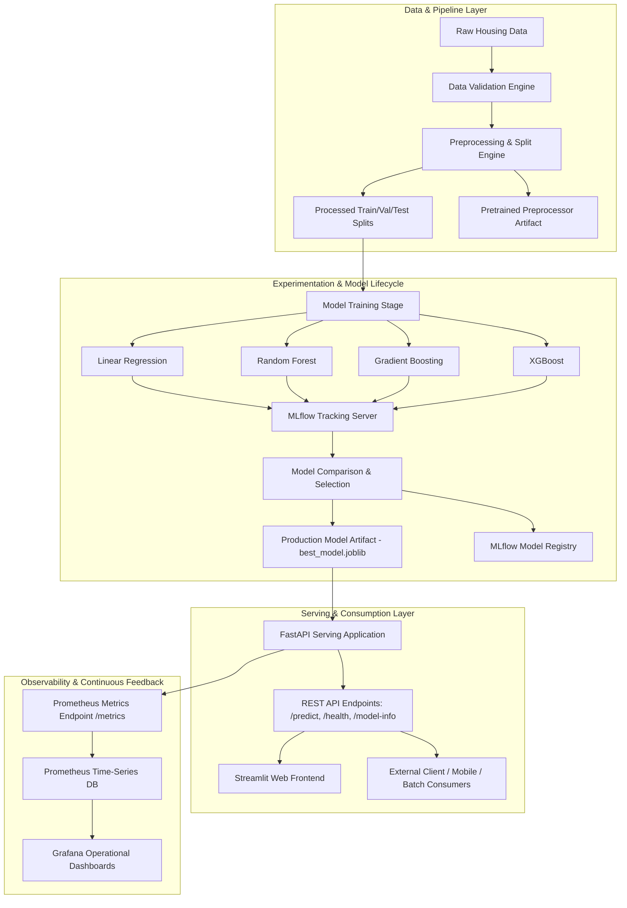
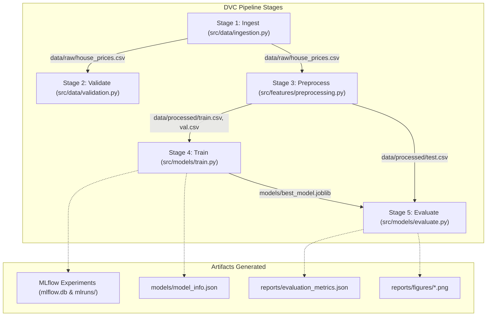
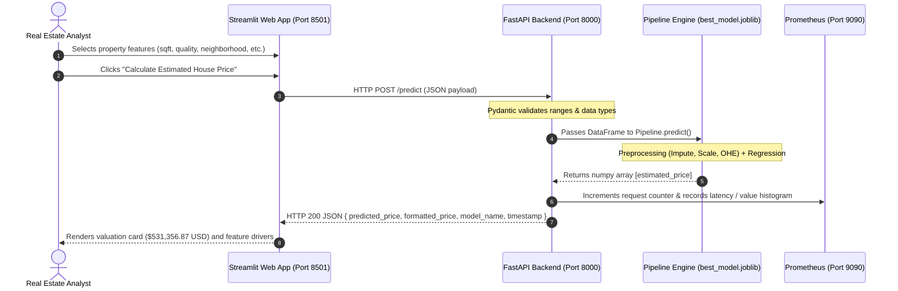

# Architecture & System Design

**Project Title:** End-to-End MLOps Pipeline for House Price Prediction  
**Problem Type:** Supervised Machine Learning (Tabular Regression)  
**Target:** Residential Property Sale Price (`SalePrice` in USD)

---

## 1. High-Level Architecture Overview

The system is designed with strict separation of concerns, decoupling the **Training & Experimentation Pipeline** from the **Inference & Serving Layer**, and establishing continuous **Operational Monitoring**.



---

## 2. Training & Experimentation Pipeline (DVC & MLflow)

The model training pipeline is versioned and executed through **Data Version Control (DVC)**. Each stage specifies its explicit code dependencies, data dependencies, configuration parameters, and output artifacts:



### Stage Details

1. **Ingestion Stage (`src/data/ingestion.py`):**
   - Retrieves raw real-estate data from local storage, remote URL, or generates a realistic benchmark dataset based on Ames Housing distributions.
   - Guarantees zero hard-coded paths via `configs/config.yaml`.

2. **Validation Stage (`src/data/validation.py`):**
   - Verifies column presence, data types, null percentage thresholds, and target bounds.
   - Prevents downstream pipeline failures before computing resources are allocated.

3. **Preprocessing Stage (`src/features/preprocessing.py`):**
   - Performs train/validation/test splitting (`1050 / 150 / 300` records).
   - Fits scikit-learn `ColumnTransformer` (median numeric imputation, standard scaling, categorical one-hot encoding) **strictly on training data** to prevent data leakage.
   - Persists splits and the fitted preprocessor artifact.

4. **Training Stage (`src/models/train.py`):**
   - Builds composite scikit-learn `Pipeline` objects combining preprocessor and regressors.
   - Fits 4 candidate algorithms: Linear Regression, Random Forest, Gradient Boosting, and XGBoost.
   - Logs hyperparameters, run duration, metrics (MAE, RMSE, $R^2$), and models to **MLflow**.
   - Evaluates validation metrics, selects the best performer, and saves `models/best_model.joblib`.

5. **Evaluation Stage (`src/models/evaluate.py`):**
   - Evaluates the winning model on unseen holdout test data (`test.csv`).
   - Generates publication-ready figures under `reports/figures/` (Actual vs Predicted, Residuals Distribution, Model Comparison).

---

## 3. Real-Time Inference Architecture



---

## 4. Container & Service Topology (Docker Compose)

```mermaid
graph LR
    subgraph Docker Network: mlops-net
        C1[house_price_api :8000]
        C2[house_price_streamlit :8501]
        C3[house_price_mlflow :5000]
        C4[house_price_prometheus :9090]
        C5[house_price_grafana :3000]
    end

    User((User / Browser)) -->|Port 8501| C2
    C2 -->|Internal HTTP| C1
    User -->|Port 8000 (Swagger)| C1
    User -->|Port 5000 (MLflow UI)| C3
    C4 -->|Scrapes /metrics every 5s| C1
    C5 -->|PromQL Queries| C4
    User -->|Port 3000 (Dashboards)| C5
```
